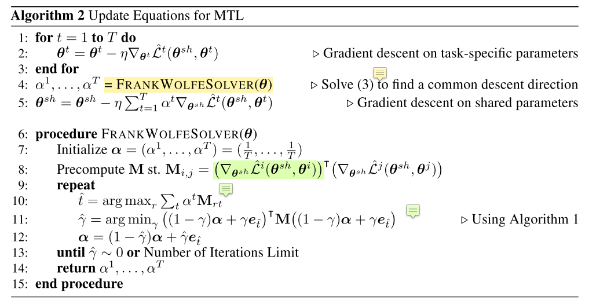

# NIPS2018 - 用多目标优化解决多任务学习

题外话: 多任务学习可以说是机器学习的终极目标之一, 就像物理学家在追求统一所有力一样, 个人认为机器学习也在追求一个模型解决几乎所有问题. 虽然我们现在还离这个目标很远, 但是多任务学习在实际应用中是非常有价值的, 对于像BERT这么复杂的模型, 用一个模型解决多个问题才能物尽其用啊. (稍稍推广下[bert-multitask-learning](https://github.com/JayYip/bert-multitask-learning))

这是Intel在NIPS 2018上发表的关于多任务学习的文章: [Multi-Task Learning as Multi-Objective Optimization](https://arxiv.org/abs/1810.04650). 多任务学习其实有很多种做法, hard parameter sharing, soft parameter sharing等等, 但是个人认为hard parameter sharing更加具有实用价值, 这里不展开说了. 这篇文章属于用hard parameter sharing 做多任务学习, 通过loss weighting来提升效果, 而本文的主要贡献是对这个weight的快速计算. 作者在文章中说了以下事情:

1. 介绍了用多目标优化解决多任务学习的一般形式
2. 介绍了怎么比较多任务学习结果的优劣: 帕累托最优
3. 将帕累托最优的求解转化成任务权重的求解
4. 证明如何简化该计算

文章的idea其实很简单, 但是理论比较多, 如果对理论不感兴趣的话了解一下作者做了什么工作就好了: 通过链式法则的推导, 并证明了, 在梯度为full rank的情况下, 我们不需要对每个任务的向后传播都算到底(所有层), 只需要算到共享模型的最后一层, 用这个去解出各个任务的权重, 既能加快速度, 又能得到一个比较好的解. 下面我会**尝试**总结一下作者的推导过程.

## 符号解释

- $t, T$: 任务以及任务集合
- $\theta, \theta^{sh}$: 模型参数, 共享的模型参数
- $\alpha$: 任务权重
- $\eta$: 学习率
- $Z$: $\theta^{sh}$的最后一层输出
- $\mathcal{L}$: 损失函数
- $\mathcal{X}, \mathcal{Y}^t$: 输出空间和任务t的标签空间

## 多目标优化解决多任务学习的一般形式

多任务学习可以一般可以表示为最小化下面式子:

$$
\min_{\theta^{sh}, \theta^1, \dots, \theta^T} \sum^T_{t=1} \alpha^t \hat{\mathcal{L}}^t(\theta^{sh}, \theta^t)
$$

## 帕累托最优

我们可以想象, 对于不同的$\alpha^t$ 的取值, 我们可以学到不同的参数$\theta$, 那么我们怎么判断参数之间的优劣呢? 显然的, 如果对于参数$\theta^1$, 在每个任务上的表现都大于等于$\theta^2$, 那么我们就认为$\theta^1$比$\theta^2$要好(dominiate). 按照这个条件, 如果参数$\theta^{*}$不差于任何参数, 那么$\theta^{*}$则称为**帕累托最优**.

## 用求解任务权重解帕累托最优

这是问题的第一步转换, 理论基础是[这篇文章](https://www.sciencedirect.com/science/article/pii/S1631073X12000738)(我没看). 文章证明了, 下面式子的解要么是帕累托静止点(帕累托最优的必要条件), 要么是一个能优化所有任务的好的优化方向.

$$
\min _{\alpha^{1}, \ldots, \alpha^{T}}\left\{\left\|\sum_{t=1}^{T} \alpha^{t} \nabla_{\boldsymbol{\theta}^{s h}} \hat{\mathcal{L}}^{t}\left(\boldsymbol{\theta}^{s h}, \boldsymbol{\theta}^{t}\right)\right\|_{2}^{2} | \sum_{t=1}^{T} \alpha^{t}=1, \alpha^{t} \geq 0 \quad \forall t\right\}
$$

我们可以看到, $\theta^t$的梯度和$\alpha^t$是没啥关系的, $\alpha^t$只作用在$\theta^{sh}$的梯度上, 因此向后传播的过程为:

1. 对所有$\theta^t$做一般的gradient descent
2. 解出上面式子, 并对$\theta^{sh}$做$\sum_{t=1}^{T} \alpha^{t} \nabla_{\boldsymbol{\theta}^{s h}}$的gradient descent.

计算过程写下来就是原文里面的Algorithm2:

## 简化上述计算

从Algorithm2第8行可以看到, 对于share parameters的梯度, 需要对每个任务都算一遍, 当任务比较多的时候, 运算复杂度高, 因此, 作者提出了第二步转换, 也是本文的主要工作.

复合函数求导的链式法则可得上界:

$$
\left\|\sum_{t=1}^{T} \alpha^{t} \nabla_{\boldsymbol{\theta}^{s h}} \hat{\mathcal{L}}^{t}\left(\boldsymbol{\theta}^{s h}, \boldsymbol{\theta}^{t}\right)\right\|_{2}^{2} \leq\left\|\frac{\partial \mathbf{Z}}{\partial \boldsymbol{\theta}^{s h}}\right\|_{2}^{2}\left\|\sum_{t=1}^{T} \alpha^{t} \nabla_{\mathbf{Z}} \hat{\mathcal{L}}^{t}\left(\boldsymbol{\theta}^{s h}, \boldsymbol{\theta}^{t}\right)\right\|_{2}^{2}
$$

其中Z为输入的最后一层的表示. 去掉与alpha不想关的项, 可得:

$$
\min _{\alpha^{1}, \ldots, \alpha^{T}}\left\{\left\|\sum_{t=1}^{T} \alpha^{t} \nabla_{\mathbf{Z}} \hat{\mathcal{L}}^{t}\left(\boldsymbol{\theta}^{s h}, \boldsymbol{\theta}^{t}\right)\right\|_{2}^{2} | \sum_{t=1}^{T} \alpha^{t}=1, \alpha^{t} \geq 0 \quad \forall t\right\}
$$

然后作者证明了 $\frac{\partial \mathbf{Z}}{\partial \boldsymbol{\theta}^{s h}}$在full rank 的情况下, MGDA-UB(Multiple Gradient Descent Algorithm – Upper Bound, 就是上面的那个公式)的解要么是Pareto stationary point(Pareto optimal的必要条件), 要么是一个能优化所有任务的好的优化方向. 那么算法修改的地方是Algorithm 2中的第8行的梯度计算, 从对所有share parameters算梯度改成对最后一层表示的梯度.

## 实验结果

作者在MultiMNIST和CelebA数据集上取得了超过single task的结果. 训练时间也极大地缩短了(任务越多, 训练时间差距越大). 从作者的实验结果也可以看到, 简单的average的效果其实是不如single task的.

需要注意的是, 在本文我忽略了很多过程, 只把我认为的最关键的部分拿了出来, 主要是为了简单叙述一下作者简化计算的方法. 